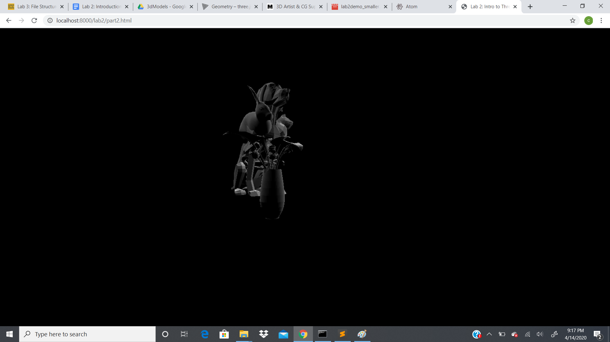

# CMPM163Labs- 
Lab2:
video>https://drive.google.com/file/d/1XX-DLysuU2ZrbfWxkUdste22hfziRb09/view?usp=sharing

lab3:
video>https://drive.google.com/file/d/1i25Qpow5p8Lg8lk0ahreMc33v8WtrxnA/view?usp=sharing
The first cube, I used the existing fragment shader and added two more colors. I then align them with vUv.x and vUv.y.
For the second cube, I loaded an excisting material in the Three.js and gave it a shine with a certain color.
For the third cube, I created a fragment shader that used two colors to mix them at a certain vertex on the 3D model.
For the fourth cube, I loaded another material that created a flat color and gave the illusion of different colors being present.

lab4:
24.a)u=.125(x+1) so x=u/.125-1. b) v=1-.125(y+1) so y=((v-1)/-.125)-1 c)the colored sampled is grey 
video>https://drive.google.com/file/d/1Y5BIssN4rOYToJbXULKnZvT1iYvsHwHl/view?usp=sharing
1 cube:I added a cube and loaded a texture on the cube without the uv map.
2 cube:For the second cube recreated the first cube and added the uv map to see the difference between the two.
3 cube:I created a third cube with an entirely new texture and uv map.
4 cube:For the 4 cube I created my own uv maps for which I loaded a new texture to this involve the creation of fragmentshaders and vextexshaders
5 cube:The 5 cube was a challenge. In order to create this cube I had to learn about the mod() that in a way changes the link between the uv and xy coordinates. This allowed me to make a pattern on the mesh.

lab5:
video-https://drive.google.com/file/d/1xk4D_RT25IMN17XUWsH93I-w9cJPVw8d/view?usp=sharing
